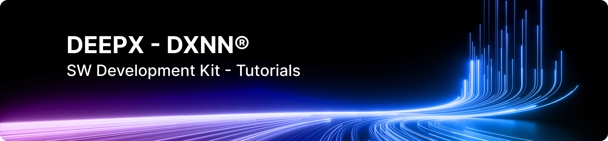

# DEEPX SDK Tutorials


 

**Welcome!** This repository contains a growing collection of hands-on Jupyter Lab tutorials designed for learners of all levels getting started with DEEPX products. Whether you're just getting started or looking to master advanced features, you will find valuable resources here.

Our goal is to provide clear, step-by-step guides to help you become more productive and efficient in your data science and development workflows using the DEEPX SDK.

> This tutorials are based on dx-all-suite v2.3.0, released in April 2026.

## 📚  Table of Contents
* **Tutorial-00 (JupyterLab QuickStart)**: JupterLab overview.
* **Tutorial-01 (Getting Started)**: Learn how to install the DEEPX SDK and verify the installation.
* **Tutorial-02 (DX-APP)**: Introduction to DX-APP and demonstrations on running inference with image, video, and camera inputs.
* **Tutorial-03 (E2E AI workflow)**: Hands-on practice implementing a Forklift-Worker detector using YOLOv7.
* **Tutorial-04 (DX-STREAM)**: Explore DX-STREAM and practice integrating it with the Forklift-Worker detector.
* **Tutorial-05 (DX-Compiler)**: Learn how to use DX-Compiler and practice compiling various AI models with different preprocessing options.
* **Tutorial-06 (DX-Runtime)**: WIP...
* **Tutorial-10 (DEMO-PaddleOCRv5)**: Implementing an E2E pipeline for PaddleOCRv5 on DEEPX NPU (A step-by-step guide).
* **Tutorial-11 (DEMO-CLIP)**: WIP...
* ... (More to come!)


### Repository Structure
```text
dx-tutorials
├── notebooks
│   ├── T00-JupyterLab-QuickStart
│   │   └── jupyterlab_quickstart.ipynb
│   ├── T01-Getting-Started
│   │   └── getting_started.ipynb
│   ├── T02-DX-APP
│   │   └── dx_app.ipynb
│   ├── T03-E2E-AI-Workflow
│   │   └── e2e_ai_workflow.ipynb
│   ├── T04-DX-STREAM
│   │   └── dx_stream.ipynb
│   ├── T05-DX-Compiler
│   │   └── dx_compiler.ipynb
│   └── T10-DEMO-PaddleOCRv5
│       └── paddleocr.ipynb
├── README.md
├── requirements.txt
├── run-jupyter-lab.sh
└── sudo_no_password.sh
```


## ⚙️ Installation Guide

### 1. Prerequisites:
```bash
sudo apt-get update
sudo apt-get upgrade
sudo apt-get install python3-venv build-essential python3-dev git-all ffmpeg tree curl
```

### 2. Install uv
```bash
curl -LsSf https://astral.sh/uv/install.sh | sh
export PATH="$HOME/.local/bin:$PATH"
uv --version
```

### 3. Download this dx-tutorials repo
```bash
git clone https://github.com/dx-maxkim/dx-tutorials.git
cd dx-tutorials
```


### 4. Create/Activate a Python virtual environment with uv
```bash
uv venv
source .venv/bin/activate
```

### 5. Install required packages from requirements.txt with uv
```bash
uv pip install -r requirements.txt
```


## 🚀 Usages

### Run jupyter-lab
To start the tutorial environment, run the provided script:
```bash
./run-jupyter-lab.sh
```

### External connection (Optional)
<details> <summary><b>Click here to configure remote access</b></summary>
If you are running this on a remote server and want to access it from your local browser:

1. Generate the config file:
    ```bash
    jupyter-lab --generate-config
    ```

2. Edit the config file (vi ~/.jupyter/jupyter_lab_config.py) and add:
    ```bash
    c.ServerApp.ip = '0.0.0.0'
    c.ServerApp.token = ''
    c.ServerApp.password = ''
    c.ServerApp.open_browser = False
    ```
</details>

## 💡 Troubleshooting
 

For questions or feedback, please contact dgkim@deepx.ai or create an issue ticket.
