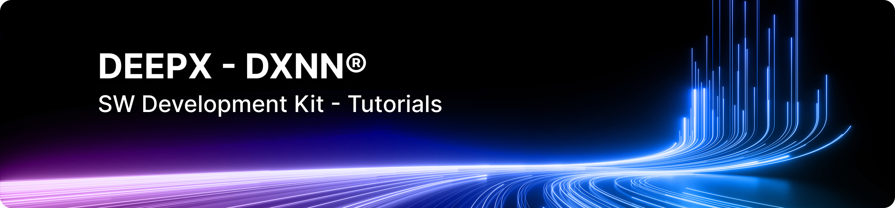

# DEEPX SDK Tutorials


 

**Welcome!** This repository is a collection of hands-on JupyterLab tutorials for the DEEPX SDK (DX-All Suite). It starts with installing the SDK, continues with the compiler and the runtime, and ends with complete Python and C++ applications on the DEEPX NPU.

> These tutorials are based on dx-all-suite v2.4.0, released in July 2026.

## 📚 Tutorials

| Tutorial | What you learn | Needs an NPU | Other requirements |
|---|---|---|---|
| **00 JupyterLab QuickStart** | Cells, kernels, shell commands, shortcuts | - | - |
| **01 Getting Started** | Clone DX-All Suite, install DX-COM, DX-TRON, and DX-Runtime, verify the NPU, use the DX-RT CLI tools | Yes | `sudo` for the installers; reboot after the driver |
| **02 DX-APP** | Ready-to-run C++ and Python examples for every Model Zoo model: run the bundled demos, then export standalone examples and run any model you choose | Yes | Display; camera optional |
| **03 E2E AI Workflow** | Train, compile, and deploy a custom YOLOv7 Forklift and Worker detector | Yes | Training is optional and needs an NVIDIA GPU |
| **04 DX-STREAM** | GStreamer pipelines with DX-STREAM, a custom postprocessor, and a Python people counter | Yes | Display; camera and RTSP optional; `sudo` for the rebuild |
| **05 DX-Compiler** (3 parts) | 05-1 Beginner: ONNX to DXNN. 05-2 Intermediate: calibration, PPU, graph optimization. 05-3 Advanced: quantization strategies and the Python API | For the `dxrun` comparisons | DX-COM only runs on x86_64; 16 GB RAM |
| **06 DX-Runtime** (3 parts) | 06-1 Beginner: CLI tools. 06-2 Intermediate: Python and C++ APIs. 06-3 Advanced: profiling, tuning, release validation | Yes | `uv`, `cmake` |
| **10 PP-OCRv6 demo** | Compile six OCR models and run a Python camera OCR application | Yes | Camera and display for the live app |
| **20 YOLO Multi-Channel demo** | A C++ application that runs one PPU model on up to 36 video channels | Yes | Display; OpenCV and GStreamer packages |
| **21 YOLO26 OD, Pose, Seg, Depth demo** | Four asynchronous pipelines on one stream in a Qt application | Yes | Display; Qt5 |
| **22 CLIP Single-Stream demo** | Zero-shot text and image matching in C++ | Yes | Display; Qt5; ONNX Runtime C++ |
| **23 Hand Landmarks demo** | Two-stage palm detection and 21-point hand landmarks in C++ | Yes | Display; Qt5 |
| **24 PIDNet Cityscapes demo** | Semantic segmentation with a live post-processing control in C++ | Yes | Display; Qt5 |

Follow the tutorials in order: 00 and 01 first, then 02 to 06, then the demos. Each notebook ends with a **Next** pointer to the one that follows.

### Repository structure
```text
dx-tutorials
├── notebooks
│   ├── T00-JupyterLab-QuickStart/        jupyterlab_quickstart.ipynb
│   ├── T01-Getting-Started/              getting_started.ipynb
│   ├── T02-DX-APP/                       dx_app.ipynb
│   ├── T03-E2E-AI-Workflow/              e2e_ai_workflow.ipynb
│   ├── T04-DX-STREAM/                    dx_stream.ipynb
│   ├── T05-DX-Compiler/                  dx_com_01_beginner / 02_intermediate / 03_advanced.ipynb
│   ├── T06-DX-Runtime/                   dx_rt_01_beginner / 02_intermediate / 03_advanced.ipynb
│   ├── T10-demo-paddleocr/               paddleocr_v6.ipynb, app/ (Python application)
│   ├── T20-demo-yolo-multi/              yolo_multi.ipynb, app/ (C++), get_resources.sh
│   ├── T21-demo-yolo26-od-pose-seg-depth/ yolo26_od_pose_seg_depth.ipynb, app/, get_resources.sh
│   ├── T22-demo-clip-single/             clip_single.ipynb, app/, get_resources.sh
│   ├── T23-demo-hand-landmarks/          hand_landmarks.ipynb, app/, get_resources.sh
│   └── T24-demo-pidnet-cityscapes/       pidnet_cityscapes.ipynb, app/, get_resources.sh
├── docs/                   platform notes (Raspberry Pi 5, Orange Pi 5 Plus, Intel GPU) and the maintenance checklist
├── tutorial_paths.py       shared path resolution and requirement checks used by every notebook
├── config.example.json     template for the user-local config.json (see below)
├── requirements.txt        JupyterLab environment
├── run-jupyter-lab.sh      creates the environment and starts JupyterLab
└── sudo_no_password.sh     optional: lets the install cells run sudo without a password (see below)
```

Every tutorial keeps its generated files (downloaded models, compiled DXNN files, build outputs, reports) under its own `workspace/` or `assets/` directory. Those directories are ignored by git.

## ⚙️ Installation

### 1. Prerequisites
```bash
sudo apt-get update
sudo apt-get install python3-venv build-essential python3-dev git-all ffmpeg tree curl cmake
```

### 2. Install uv
```bash
curl -LsSf https://astral.sh/uv/install.sh | sh
export PATH="$HOME/.local/bin:$PATH"
uv --version
```

### 3. Clone this repository
```bash
git clone --depth 1 --single-branch https://github.com/DEEPX-AI/dx-tutorials.git
cd dx-tutorials
```

### 4. Start JupyterLab
```bash
./run-jupyter-lab.sh
```

The script creates `.venv` with the packages from `requirements.txt` and starts JupyterLab from it **without activating the environment**. Notebook cells and the JupyterLab terminal therefore see the system `python3`, so the SDK installers create their own Python environments instead of touching this one. Packages that a single tutorial needs (ONNX tools, OpenCV, PyTorch for the export examples) are installed by that notebook with `uv pip install --python "{sys.executable}"` when they are first used.

### 5. Tell the tutorials where DX-All Suite is

Tutorial 01 clones DX-All Suite and installs the SDK. The location is resolved in this order and shown at the top of every notebook:

1. the `DX_ALL_SUITE_DIR` environment variable,
2. `config.json` in this directory (written by Tutorial 01; `config.example.json` shows the fields; the file itself is not tracked by git),
3. auto-detection of `~/dx-all-suite`, a `dx-all-suite` folder next to `dx-tutorials`, or `~/Works/dx-all-suite`,
4. the default `~/dx-all-suite`.

To set it from a terminal:
```bash
python tutorial_paths.py --set ~/my/dx-all-suite
python tutorial_paths.py --show
```

### `sudo` inside notebook cells

The SDK installers call `sudo apt-get`. A notebook cell cannot answer a password prompt, so the install cells check `sudo -n true` first: when `sudo` works without a password they run the installer inline, otherwise they print the same commands for a terminal. `sudo_no_password.sh` configures passwordless `sudo` for the `sudo` group by writing `/etc/sudoers.d/sudo-nopasswd`. Use it only on a personal or lab machine; it removes the password check for every `sudo` command of that group.

## ✍️ Conventions used in the notebooks

- The first code cell of every notebook is identical: it loads `tutorial_paths.py`, resolves the SDK location, checks the requirements of that notebook, and prints a status table.
- Every command a learner needs appears verbatim in the cell that runs it (`!git clone ...`, `!dxcom ...`, `!./build.sh`), with the same command shown in the Markdown above it so it can be copied into a terminal. The only exceptions are a few cells that parse a command's output; those print the exact command with a `$` prefix before running it.
- Cells that open a window or need hardware are guarded by a flag (`RUN_CAMERA`, `RUN_VIDEO`, `FLASH_FIRMWARE`) so that *Run All* never blocks or changes the system by accident.
- Sections are numbered `## 1.`, `### 1.1`, `#### 1.1.1`. Each notebook starts with learning objectives and prerequisites and ends with troubleshooting, a summary, a completion checklist, and a pointer to the next tutorial.

## 🌐 Languages

The English notebook is the source of truth. Translated copies are generated next to it and share
the same code cells, so one verification run covers every language:

| File | Role |
|---|---|
| `notebooks/T01-Getting-Started/getting_started.ipynb` | English source (edit this one) |
| `i18n/<lang>/T01-Getting-Started/getting_started.md` | Translations of the Markdown cells, one block per cell id |
| `notebooks/T01-Getting-Started/getting_started.<lang>.ipynb` | Generated: same code cells, translated Markdown. Do not edit by hand |

Every notebook that has translations starts with a language switcher line (`🌐 English | 한국어 | 日本語 | 中文`).
Currently T01 is available in Korean (`ko`), Japanese (`ja`), and Chinese (`zh`).

```bash
# After editing English Markdown or a translation: regenerate the <lang>.ipynb files
python scripts/build_i18n.py build

# Report missing or stale translations and out-of-date generated notebooks (exit 1 on problems)
python scripts/build_i18n.py check

# Start a new language: write an English template to translate
python scripts/build_i18n.py init notebooks/T01-Getting-Started/getting_started.ipynb --lang ja
```

A translation block records the hash of the English cell it was made from. When the English text changes,
`check` lists that cell as *stale*; translate it again and run `python scripts/build_i18n.py stamp <notebook>`
to record the new hash.

## 💡 Troubleshooting
 

Platform notes: [Raspberry Pi 5 PCIe Gen3](docs/raspberrypi5.md), [Orange Pi 5 Plus kernel headers](docs/orangepi5p.md), [Intel GPU drivers for DX-STREAM](docs/intel_gpu.md).

For questions or feedback, please contact dgkim@deepx.ai or create an issue ticket.
