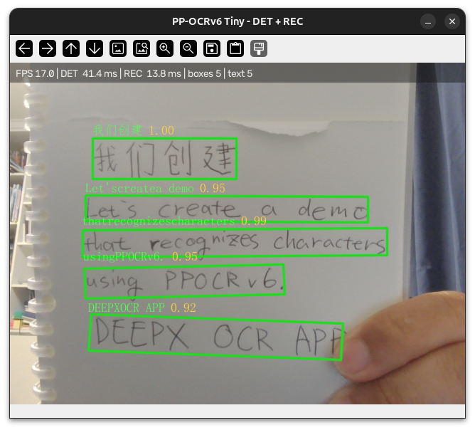

# PP-OCRv6 on DEEPX NPU (Python Demo)



Builds a complete OCR pipeline on the NPU: downloads the PP-OCRv6 tiny detection and recognition models, fixes their input shapes, compiles six DXNN models with DX-COM, verifies them, and runs a Python camera application that routes each text line to the recognition model with the best aspect ratio.

## What you need

- A supported DEEPX NPU with DX-COM and DX-RT installed (Tutorial 01)
- `uv` (installed by the repository setup)
- A USB camera and a display for the live application (the `--check` smoke test runs without them)

## Run the tutorial

Start JupyterLab from the repository root and open `notebooks/T10-demo-paddleocr/paddleocr_v6.ipynb`:

```bash
./run-jupyter-lab.sh
```

## Project layout

```text
T10-demo-paddleocr/
├── paddleocr_v6.ipynb   # the tutorial
├── README.md
├── app/                 # camera_app.py, ocr_engine.py, run_camera.sh, dictionary and font assets
├── assets/              # figures used by the notebook
└── workspace/           # models, configs, compiled DXNN files (created by the notebook, ignored by git)
```
