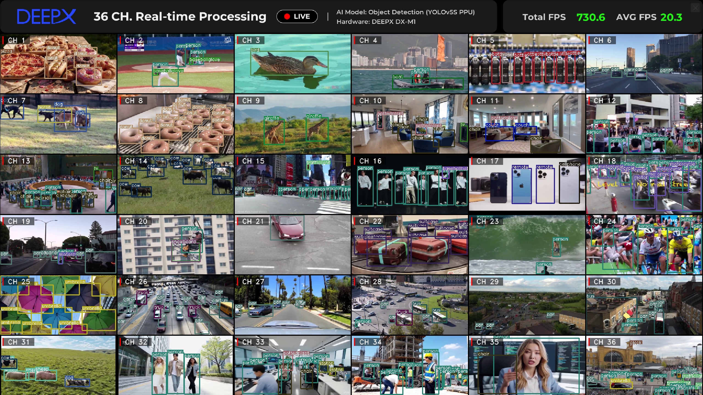

# YOLO Multi-Channel C++ Demo



Runs one YOLOv5s PPU model on up to 36 video channels at once. Every channel has its own worker thread that submits frames to a shared DXRT inference engine asynchronously, and the main loop tiles the results into one OpenCV window.

## What you need

- A supported DEEPX NPU with DX-RT installed (Tutorial 01)
- A graphical desktop session for the OpenCV window
- A V4L2 camera at `/dev/video0` for the camera demo (optional)

## Run the tutorial

Everything else (package installation, resource download, build, run commands, options, and troubleshooting) is in the notebook. Start JupyterLab from the repository root and open it:

```bash
./run-jupyter-lab.sh
```

Then open `notebooks/T20-demo-yolo-multi/yolo_multi.ipynb` in JupyterLab and run the cells from the top.

## Project layout

```text
T20-demo-yolo-multi/
├── yolo_multi.ipynb      # the tutorial
├── README.md
├── get_resources.sh    # downloads the models and sample videos into assets/
├── app/                # C++ sources, CMakeLists.txt, build.sh, run_camera.sh, run_video.sh
└── assets/             # models/ and videos/ (downloaded, ignored by git)
```
