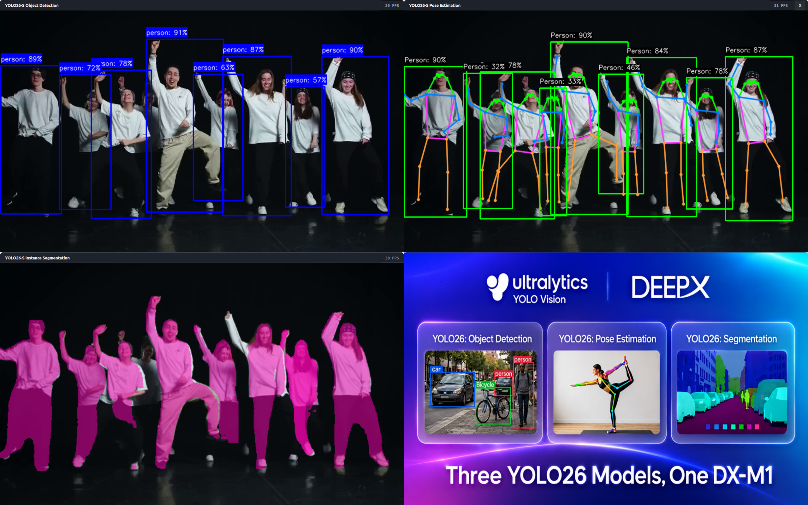

# Tutorial 21: YOLO26 Object Detection, Pose, and Segmentation Demo

This tutorial builds and runs a Qt-based C++ demo that processes one camera or video stream with three YOLO26-S models on a DEEPX NPU.

The full-screen window uses a 2 x 2 layout:

1. object detection;
2. pose estimation;
3. instance segmentation; and
4. a static demo image.



## Project layout

```text
T21-demo-yolo26-od-pos-seg/
├── yolo26_od_pose_seg.ipynb  # Tutorial and executable examples
├── README.md                 # Quick-start guide
├── get_resources.sh         # Downloads and extracts the required resources
├── assets/
│   ├── models/              # Detection, pose, and segmentation models
│   ├── yolo26.png           # Static fourth-panel image
│   └── videos/              # Input videos
└── app/
    ├── build.sh
    ├── run_camera.sh
    ├── run_video.sh
    ├── CMakeLists.txt
    ├── yolo26s_3.cpp
    ├── common/
    │   ├── base/            # Processing interfaces and result types
    │   ├── processors/      # YOLO26 preprocessing and post-processing
    │   └── utility/         # Model input, labels, and version helpers
    ├── factory/             # Detection, pose, and segmentation factories
    └── extern/              # Header-only cxxopts dependency
```

## Prerequisites

- A supported DEEPX NPU
- The DEEPX device driver and DXRT SDK
- A graphical desktop session for the Qt window
- A V4L2 camera for the camera demo

Install the required Debian or Ubuntu packages:

```bash
sudo apt-get update
sudo apt-get install -y \
    build-essential \
    cmake \
    pkg-config \
    qtbase5-dev \
    libopencv-dev \
    ffmpeg \
    v4l-utils
```

Verify that DXRT can see the NPU:

```bash
dxrt-cli -s
```

## 1. Prepare resources

Run the resource setup script from the tutorial directory:

```bash
cd notebooks/T21-demo-yolo26-od-pos-seg
./get_resources.sh
```

The script downloads and extracts the models, demo image, and sample video into `assets/`. If every required file is already available and non-empty, it skips the download. After a successful extraction, it removes the downloaded archive.

The application expects these default files:

```text
assets/
├── models/
│   ├── yolo26s.dxnn
│   ├── yolo26s-pose.dxnn
│   └── yolo26s-seg.dxnn
├── yolo26.png
└── videos/
    └── dance-960-540.mp4
```

Custom model and image paths can be passed with `--model`, `--model-pose`, `--model-seg`, and `--demo-image`.

## 2. Build the application

```bash
cd notebooks/T21-demo-yolo26-od-pos-seg/app
./build.sh
```

The script configures a Release build and uses all available CPU cores. The executable is created at:

```text
app/build/yolo26s_3
```

Use a clean build when needed:

```bash
./build.sh --clean
```

## 3. Run the camera demo

The default camera is `/dev/video0` with a requested size of 1280 x 720 at 30 FPS. These defaults are used when no camera options are provided.

```bash
cd notebooks/T21-demo-yolo26-od-pos-seg/app
./run_camera.sh
```

Use `-c` or `--camera` to select another V4L2 device. Use `--width`, `--height`, and `--fps` to request its capture settings:

```bash
./run_camera.sh -c /dev/video2 --width 1920 --height 1080 --fps 30
```

The long camera option is equivalent:

```bash
./run_camera.sh --camera /dev/video2 --width 1920 --height 1080 --fps 30
```

The existing `--device` option remains available as a deprecated alias for compatibility.

## 4. Run the video demo

Pass an input video path as the first argument:

```bash
cd notebooks/T21-demo-yolo26-od-pos-seg/app
./run_video.sh ../assets/videos/dance-960-540.mp4
```

The video loops by default. Add `--no-loop-video` to stop at the end:

```bash
./run_video.sh ../assets/videos/sample.mp4 --no-loop-video
```

## Controls

- `Esc` or `q`: exit the application
- `EXIT` button: exit with the mouse

## Jupyter tutorial

Start JupyterLab from the repository root:

```bash
./run-jupyter-lab.sh
```

Open `notebooks/T21-demo-yolo26-od-pos-seg/yolo26_od_pose_seg.ipynb` and run the cells in order.

## Troubleshooting

### CMake cannot find Qt5

Install `qtbase5-dev` and configure the project again with `./build.sh --clean`.

### CMake cannot find DXRT

Confirm that the DXRT headers, CMake package files, and shared libraries are installed and visible to CMake.

### A model or image cannot be opened

Confirm that the three models exist under `assets/models/` and that `assets/yolo26.png` exists, or pass explicit paths through the command-line options.

### The camera cannot be opened

Confirm that the device exists with `v4l2-ctl --list-devices` and that the current user has permission to access it.

### The Qt window does not appear

Use a local desktop, remote desktop, or correctly configured X11 forwarding session.
