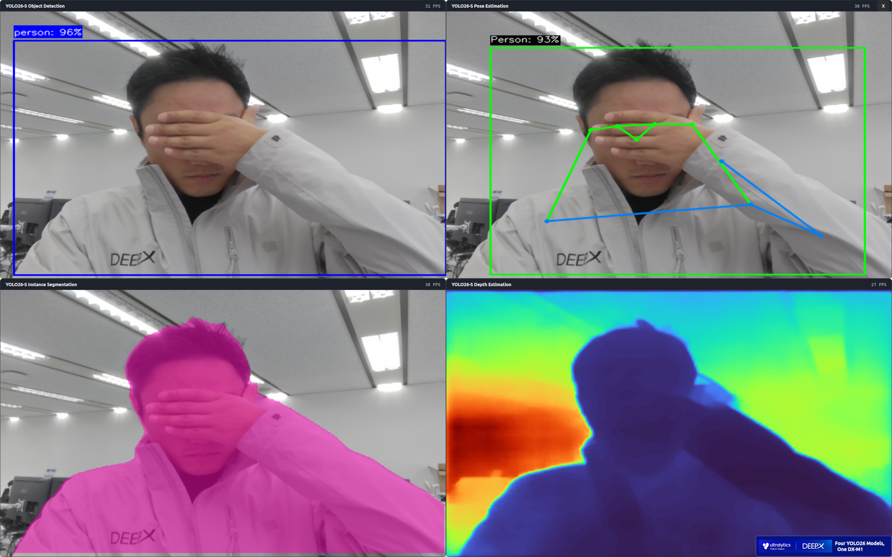

# YOLO26 Object Detection, Pose, Segmentation, and Depth Demo



Feeds one camera or video stream to four asynchronous DXRT pipelines (object detection, pose estimation, instance segmentation, depth estimation) and shows all four results live in a 2 x 2 Qt layout.

## What you need

- A supported DEEPX NPU with DX-RT installed (Tutorial 01)
- A graphical desktop session for the Qt window
- A V4L2 camera for the camera demo (optional)

## Run the tutorial

Everything else (package installation, resource download, build, run commands, options, and troubleshooting) is in the notebook. Start JupyterLab from the repository root and open it:

```bash
./run-jupyter-lab.sh
```

Then open `notebooks/T21-demo-yolo26-od-pose-seg-depth/yolo26_od_pose_seg_depth.ipynb` in JupyterLab and run the cells from the top.

## Project layout

```text
T21-demo-yolo26-od-pose-seg-depth/
├── yolo26_od_pose_seg_depth.ipynb      # the tutorial
├── README.md
├── get_resources.sh    # downloads the models and sample videos into assets/
├── app/                # C++ sources, CMakeLists.txt, build.sh, run_camera.sh, run_video.sh
└── assets/             # models/ and videos/ (downloaded, ignored by git)
```
