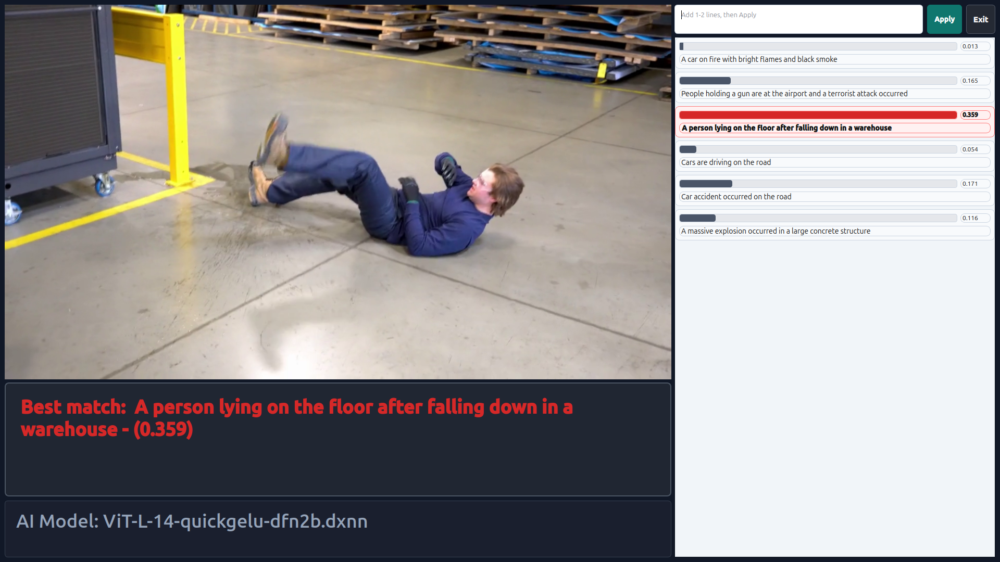

# T22: CLIP Single-Stream Demo

This tutorial builds and runs a C++ CLIP application with camera or video input. The application encodes text with ONNX Runtime, encodes images asynchronously with a DEEPX NPU, and displays text-image similarity scores in a Qt GUI.



## How it works

```text
Text queries -> BPE tokenizer -> ONNX text encoder -> text embeddings
                                                        |
Camera/video -> image preprocessing -> DXNN image encoder -> image embedding
                                                        |
                                                        v
                                         normalized dot-product scores -> Qt GUI
```

Text embeddings are computed when the application starts and cached under `.cache/text_features_cpp/`. Image inference runs asynchronously. By default, the application processes one out of every three frames.

## Project layout

```text
T22-demo-clip-single/
├── README.md
├── clip_single.ipynb
├── get_resources.sh          # Empty resource-download placeholder
├── assets/
│   ├── clip-single-sc.png    # Tutorial screenshot
│   ├── models/               # DXNN, ONNX, and BPE files
│   └── videos/               # Video input files
└── app/
    ├── CMakeLists.txt
    ├── build.sh
    ├── run_camera.sh
    ├── run_video.sh
    ├── main.cpp
    ├── clip_tokenizer.cpp
    └── clip_tokenizer.hpp
```

## Prerequisites

- A supported DEEPX NPU
- The DEEPX device driver and DXRT SDK
- ONNX Runtime C++ headers and shared library
- A graphical desktop session for the Qt window
- A V4L2 camera for the camera demo

Install the required Debian or Ubuntu packages:

```bash
sudo apt update
sudo apt install -y \
    build-essential \
    cmake \
    pkg-config \
    libopencv-dev \
    qtbase5-dev \
    zlib1g-dev
```

If DXRT or ONNX Runtime is installed in a non-standard location, pass `DXRT_INSTALLED_DIR` or `ONNXRUNTIME_ROOT` to CMake.

## Resources

`get_resources.sh` is intentionally empty. Add the download logic later or place the files manually as follows:

```text
assets/
├── models/
│   ├── ViT-L-14-quickgelu-dfn2b.dxnn
│   ├── ViT-L-14-quickgelu-dfn2b-text.onnx
│   ├── ViT-L-14-quickgelu-dfn2b-text.onnx.data
│   └── bpe_simple_vocab_16e6.txt.gz
└── videos/
    └── CLIP-demo.mp4
```

The ONNX `.data` file is required when the text encoder uses external tensor data.

## Build

```bash
cd notebooks/T22-demo-clip-single/app
./build.sh
```

For a clean build:

```bash
./build.sh --clean
```

The executable is created at `app/build/clip_single`.

## Run with a camera

```bash
cd notebooks/T22-demo-clip-single/app
./run_camera.sh
```

The default camera is `/dev/video0`, requested at 1920 x 1080 and 30 FPS. Select another camera or capture mode with:

```bash
./run_camera.sh --camera /dev/video2 --width 1280 --height 720 --fps 30
```

## Run with a video

```bash
cd notebooks/T22-demo-clip-single/app
./run_video.sh
```

The script uses `assets/videos/CLIP-demo.mp4`. Video playback loops automatically.

## Use custom text queries

The run scripts provide task-appropriate default text queries. To use only your own queries, run the executable directly:

```bash
cd notebooks/T22-demo-clip-single/app
./build/clip_single \
    --texts "A person" "A bicycle" "A cup" \
    --camera /dev/video0 \
    --skip-frames 2 \
    --full-screen \
    --exit-btn
```

For a custom video:

```bash
./build/clip_single \
    --texts "Cars are driving" "An empty road" \
    --input /path/to/video.mp4 \
    --exit-btn
```

Run `./build/clip_single --help` for all options. Press `Esc` or `Q`, or click the Exit button, to close the application.

## Performance control

`--skip-frames N` performs inference once every `N + 1` frames:

- `--skip-frames 0`: every frame
- `--skip-frames 2`: every third frame, which is the default
- A larger value reduces inference load

## Troubleshooting

- **Model file not found:** Check the filenames and locations under `assets/models/`.
- **ONNX Runtime not found during CMake:** Set `ONNXRUNTIME_ROOT` to the installation prefix.
- **Camera cannot be opened:** Check the device with `v4l2-ctl --list-devices` and pass `--camera`.
- **No GUI window:** Run from a graphical desktop session and check the `DISPLAY` environment variable.
- **First startup is slow:** The text encoder runs once and stores reusable embeddings in `.cache/text_features_cpp/`.
