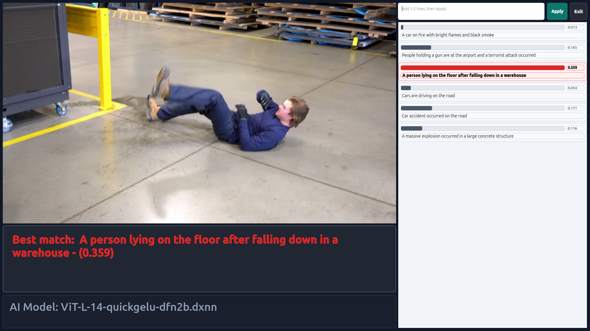

# CLIP Single-Stream C++ Demo



Matches camera or video frames against text queries with CLIP. The text encoder runs once on the CPU with ONNX Runtime, the image encoder runs continuously on the NPU, and normalized dot products rank the queries for every frame.

## What you need

- A supported DEEPX NPU with DX-RT installed (Tutorial 01)
- ONNX Runtime C++ headers and library
- A graphical desktop session for the Qt window
- A V4L2 camera for the camera demo (optional)

## Run the tutorial

Everything else (package installation, resource download, build, run commands, options, and troubleshooting) is in the notebook. Start JupyterLab from the repository root and open it:

```bash
./run-jupyter-lab.sh
```

Then open `notebooks/T22-demo-clip-single/clip_single.ipynb` in JupyterLab and run the cells from the top.

## Project layout

```text
T22-demo-clip-single/
├── clip_single.ipynb      # the tutorial
├── README.md
├── get_resources.sh    # downloads the models and sample videos into assets/
├── app/                # C++ sources, CMakeLists.txt, build.sh, run_camera.sh, run_video.sh
└── assets/             # models/ and videos/ (downloaded, ignored by git)
```
