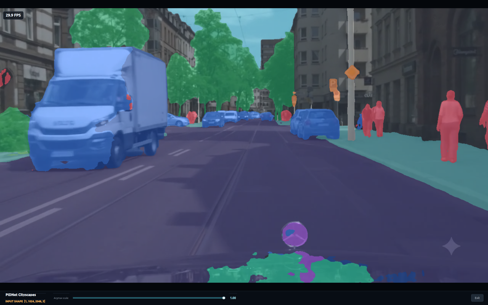

# Tutorial 24: PIDNet Cityscapes Demo

This tutorial builds and runs a Qt5 C++ application for real-time semantic segmentation with PIDNet. The application accepts camera or video input, runs inference on a DEEPX NPU, and blends a Cityscapes color mask with each frame.

The GUI includes a live **Argmax scale** slider. Move it from 0.1 to 1.0 to change the resolution used for logits interpolation and argmax. The default is 0.4. The bottom control bar also highlights the model input tensor as `INPUT SHAPE [1, 1024, 2048, 3]`.




## Model provenance

This demo references the official [XuJiacong/PIDNet](https://github.com/XuJiacong/PIDNet) project. The `PIDNet_S_Cityscapes_val.pt` PyTorch checkpoint was obtained from that project and converted to DXNN format for DEEPX NPU inference. The resulting `pidnet_s_cityscapes_val_fixed.dxnn` model is used by this application.

## How it works

```text
Camera or video frame
        |
        v
Resize to 2048 x 1024 and convert BGR to RGB
        |
        v
Asynchronous PIDNet inference -> 19 x 128 x 256 class logits
        |
        v
Interpolate logits at the selected argmax scale
        |
        v
Per-pixel argmax -> Cityscapes color mask -> Qt5 GUI
```

The exact model tensor sizes are checked at runtime. The sizes above describe the default model. Up to four inference requests are in flight by default, allowing NPU inference and CPU post-processing to overlap.

## Project layout

```text
T24-demo-pidnet-cityscrapes/
├── README.md
├── pidnet_cityscapes.ipynb
├── get_resources.sh          # Downloads and extracts the required resources
├── assets/
│   ├── models/               # PIDNet model
│   └── videos/               # Video input files
└── app/
    ├── CMakeLists.txt
    ├── build.sh
    ├── run_camera.sh
    ├── run_video.sh
    └── pidnet_cityscapes.cpp
```

## Prerequisites

- A supported DEEPX NPU
- The DEEPX device driver and DXRT SDK
- A graphical desktop session for the Qt5 window
- A V4L2 camera for the camera demo

Install the required Debian or Ubuntu packages:

```bash
sudo apt update
sudo apt install -y \
    build-essential \
    cmake \
    pkg-config \
    libopencv-dev \
    qtbase5-dev \
    ffmpeg \
    v4l-utils
```

Verify that DXRT can see the NPU:

```bash
dxrt-cli -s
```

## 1. Prepare resources

Run the resource setup script from the tutorial directory:

```bash
cd notebooks/T24-demo-pidnet-cityscapes
./get_resources.sh
```

The script downloads and extracts the PIDNet model and sample video into `assets/`. If every required file is already available and non-empty, it skips the download. After a successful extraction, it removes the downloaded archive.

```text
assets/
├── models/
│   └── pidnet_s_cityscapes_val_fixed.dxnn
└── videos/
    └── pidnet.mp4
```

The default model accepts a UINT8 `[1, 1024, 2048, 3]` tensor and produces FLOAT32 `[1, 19, 128, 256]` logits.

## 2. Build the application

```bash
cd notebooks/T24-demo-pidnet-cityscrapes/app
./build.sh
```

The script configures a Release build and uses all available CPU cores. The executable is created at `app/build/pidnet_cityscapes`.

Use a clean build when needed:

```bash
./build.sh --clean
```

## 3. Run with a camera

```bash
cd notebooks/T24-demo-pidnet-cityscrapes/app
./run_camera.sh
```

The default camera index is `0`, with a requested size of 1280 x 720 at 30 FPS. Override these values as needed:

```bash
./run_camera.sh --camera 2 --width 1920 --height 1080 --fps 30
```

## 4. Run with a video

```bash
cd notebooks/T24-demo-pidnet-cityscrapes/app
./run_video.sh
```

The script reads `assets/videos/pidnet.mp4` and loops it. Run the executable directly to use another video:

```bash
./build/pidnet_cityscapes --video /path/to/input.mp4 --loop
```

## Argmax scale slider

The compact slider is located in the control bar below the video, next to the highlighted input shape:

It covers `0.10` through `1.00` in increments of `0.05`.

- **0.1:** performs argmax at 10% of the displayed frame size. It is faster but produces coarser boundaries.
- **0.4:** provides the default balance between boundary detail and CPU post-processing cost.
- **1.0:** interpolates logits to the full frame size before argmax. It provides the finest boundaries but requires the most CPU work.

The selected value is stored atomically. Each asynchronous completion callback reads it once before processing a frame, so a change takes effect without restarting the model or video.

Set the initial value from the command line:

```bash
./run_video.sh --pidnet-argmax-scale 0.7
```

`--argmax-scale` is also accepted as a shorter alias.

## Other options and controls

- `--alpha VALUE`: set the segmentation overlay opacity from 0.0 to 1.0; the default is 0.6.
- `--inflight N`: set the maximum asynchronous requests from 1 to 6. The default is 4 for a four-core Raspberry Pi 5.
- `--no-pace`: process a video as fast as possible instead of matching its source FPS.
- `--windowed`: start in a 1280 x 800 window.
- `--full-screen`: start in full-screen mode; this is the script default.
- `Esc`, `Q`, or the **Exit** button: close the application.
- `F`: toggle full-screen mode.

Run `./build/pidnet_cityscapes --help` for the complete option list.

## Performance design

The capture thread submits frames with `RunAsync`. Completion callbacks perform argmax and mask rendering while the NPU starts other frames. A bounded in-flight limiter prevents unbounded memory growth. OpenCV's internal worker pool is limited to one thread because parallelism already occurs across callbacks; this avoids nested oversubscription on a four-core system.

Completed frames are written to a one-frame mailbox. The Qt thread always takes the newest result, so delayed frames do not build up in the GUI queue. This keeps interaction responsive when CPU post-processing cannot match the input rate.

The default `--inflight 4` matches the Raspberry Pi 5 CPU count. If CPU usage and temperature remain acceptable, test `--inflight 6` to use the complete DXRT buffer pool:

```bash
./run_video.sh --inflight 6
```

## Jupyter tutorial

Start JupyterLab from the repository root:

```bash
./run-jupyter-lab.sh
```

Open `notebooks/T24-demo-pidnet-cityscrapes/pidnet_cityscapes.ipynb` and run the cells in order.

## Troubleshooting

- **The model file is not found:** Check its filename and location under `assets/models/`.
- **The video file is not found:** Place `pidnet.mp4` under `assets/videos/` or pass another path with `--video`.
- **The camera cannot be opened:** Run `v4l2-ctl --list-devices` and select another camera index.
- **The Qt window does not appear:** Use a graphical desktop session and check the `DISPLAY` environment variable.
- **CMake cannot find DXRT:** Set `DXRT_INSTALLED_DIR` to the DXRT installation prefix and run `./build.sh --clean`.
- **Post-processing is slow:** Move the Argmax scale slider toward 0.1.
