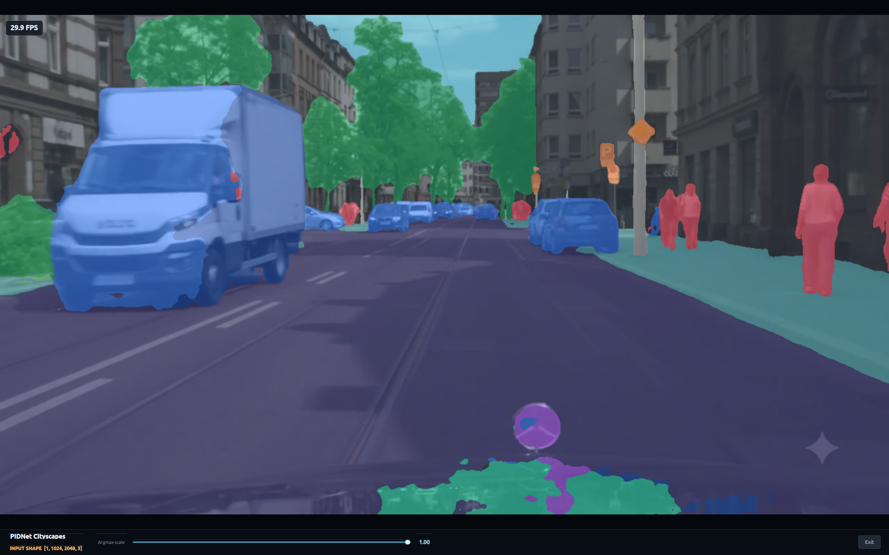

# PIDNet Cityscapes C++ Demo



Runs PIDNet semantic segmentation on the NPU and overlays Cityscapes classes on the live view. A slider changes the post-processing (argmax) resolution while the application runs, which shows the CPU and NPU trade-off directly.

## What you need

- A supported DEEPX NPU with DX-RT installed (Tutorial 01)
- A graphical desktop session for the Qt window
- A V4L2 camera for the camera demo (optional)

## Run the tutorial

Everything else (package installation, resource download, build, run commands, options, and troubleshooting) is in the notebook. Start JupyterLab from the repository root and open it:

```bash
./run-jupyter-lab.sh
```

Then open `notebooks/T24-demo-pidnet-cityscapes/pidnet_cityscapes.ipynb` in JupyterLab and run the cells from the top.

## Project layout

```text
T24-demo-pidnet-cityscapes/
├── pidnet_cityscapes.ipynb      # the tutorial
├── README.md
├── get_resources.sh    # downloads the models and sample videos into assets/
├── app/                # C++ sources, CMakeLists.txt, build.sh, run_camera.sh, run_video.sh
└── assets/             # models/ and videos/ (downloaded, ignored by git)
```
